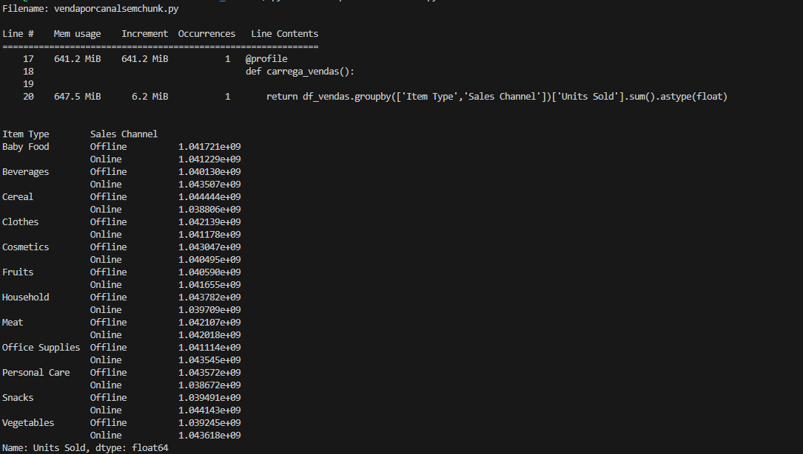
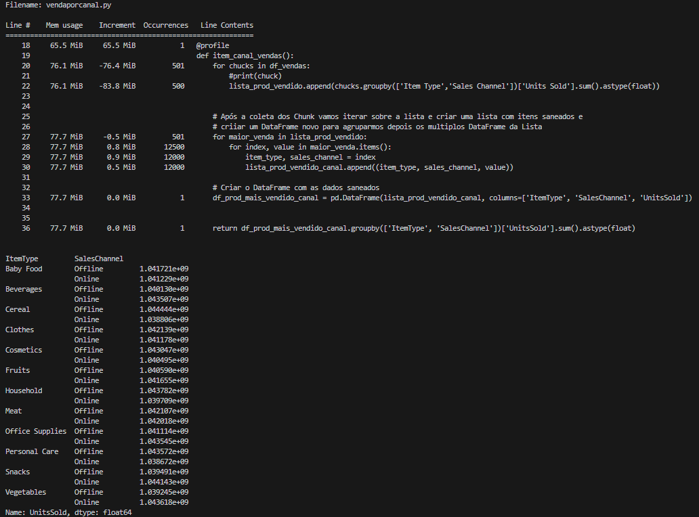

## Sobre o desafio, inicialmente pensei que abordagem diferente onde eu como engenheiro de dados preciso criar uma solução de processamento massivo de dados com recursos de memória limitado.  Na abordagem corriqueira o desafio era entregar o mais rápido possível o dado para não gerar gargalo na entrega dos modelos. Geralmente penso em como otimizar o código para não ter duplicidade de chamadas, deixar DataFrame em memória sem necessidade, bem até aqui tudo normal e quanto a infra provissionada para executar o aplicativo que geralmente é escrito em Pyspark, grande volumes de dados com Pandas? Sim, isso é possível. No entanto, é importante considerar a escalabilidade e a eficiência do processamento, especialmente quando se lida com dados massivos.

# Para monitorar o uso da memória realizada pela biblioteca Profile => "pip install -U memory_profiler". 

## Nessa primeira imagem temos o processamento utilizando a mesma proposta de relatório:. "2. Identifique o produto mais vendido em termos de quantidade e canal." Sem aplicar a técnica de Chunk da lib Pandas. Carregando todos os registros em memória.

#### O Resultado  foi o consumo de até 647.5 Mib para realizar o consumo e processamento da agregação que pode ser revisada no código. vendaporcanalsemchunk.py

## Nessa seugnda imagem é onde a mágica do particionamento em blocos acontece.O desafio é o mesmo:. "2. Identifique o produto mais vendido em termos de quantidade e canal." Agora aplicamos a técnica de Chunk da lib Pandas.

#### O Resultado  foi o consumo de até 77.7 Mib para realizar o consumo e processamento de todo a agregação, que pode ser revisada no código. vendaporcanal.py

#
# Conclusão:.
#

Comparando o resutaldo das dusa execuções podemos concluir que o processo de Chunk foi mais eficiente no consumo de memória, sem afetar o resultado da consulta. Contudo nem tudo são flores, foi necessário mais tempo para a execução do processamento e também mais código reproduzir o mesmo resultado calculado. Entretando se mostrou uma solução para quem precisa realizar ajustes ainda mais agressivos no que tange utilização de recurso e otimização na utilização. O quê nos leva a pensar, em sempre buscar soluções mais otimizadoras possível, sem claro afetar qualidade da entrega, se entraga na hora certa. Processar grandes quantidades de dados com chunk pode ser um problema dependendo da volumetria e dos calculos subjacentes isso pode ser catastrófico?!

Eficiência = 647,5 - 77,7 / 647,5 x 100

Eficiência = 569,8 / 647,5 x 100

Eficiência = approx 87,99\% 

## Fonte de Pesquisa:.
https://pandas.pydata.org/docs/user_guide/scale.html
https://www.linkedin.com/pulse/o-que-s%C3%A3o-e-para-servem-chunks-em-python-junior-souza/?originalSubdomain=pt

